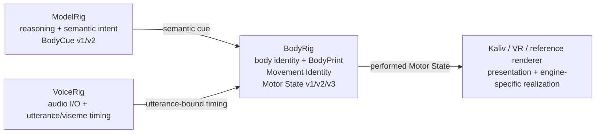
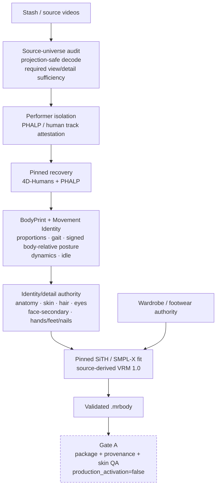
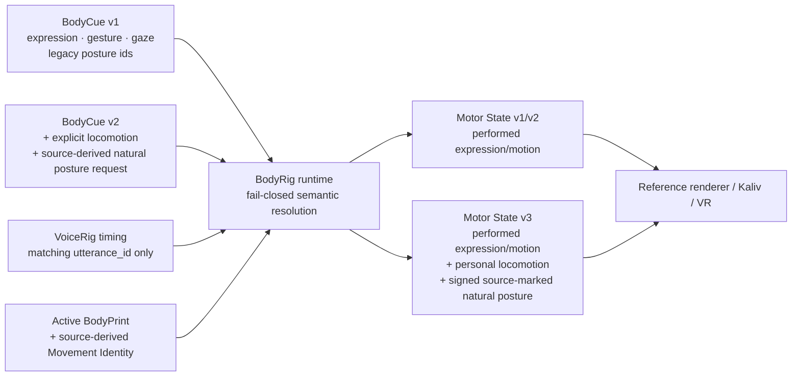
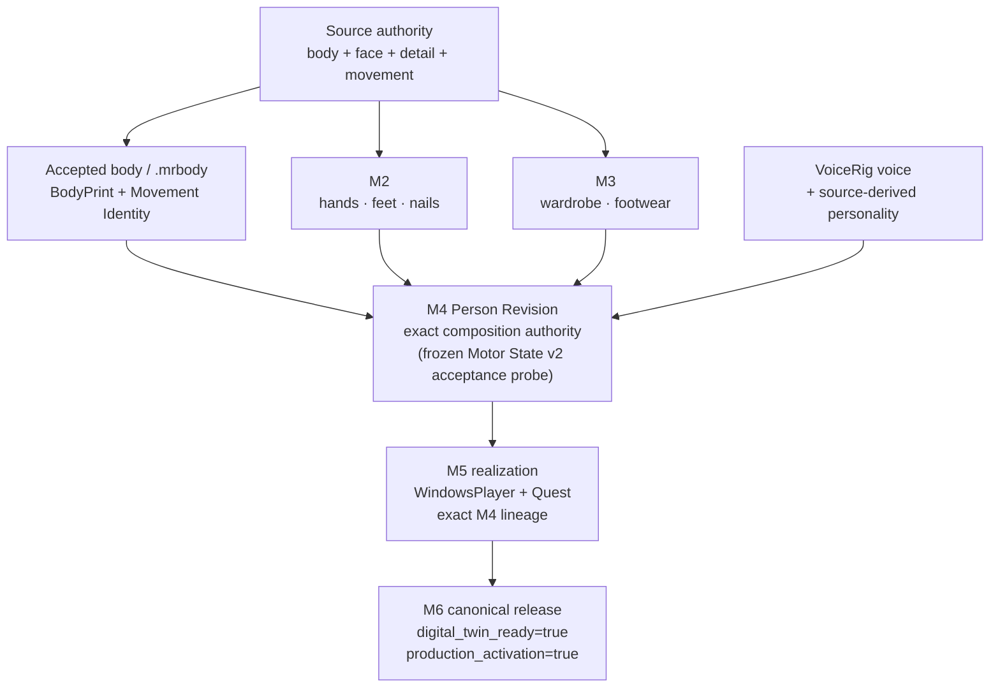
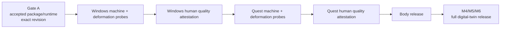

# BodyRig architecture

_Last reviewed against `main` on 2026-09-11._

BodyRig is the **body-domain authority** for the ModelRig universe. It owns body identity, `.mrbody`, BodyPrint, source-derived Movement Identity, Motor State and the evidence chain that turns source material into an accepted digital-twin body. It is not another assistant brain.

## Responsibility boundaries

ModelRig owns **what** should be expressed. BodyRig owns **how the selected body performs it**. Renderers consume already-performed Motor State and must not re-infer personality, gait, signed posture direction or gesture style from raw observations.

The standalone `Ternedal/BodyRig` repository is authoritative for BodyRig-owned contract families. ModelRig may carry compatibility adapters and mirrored schemas, but those are consumers, not a second body-domain source of truth.

## Source and build authority

The current high-fidelity path is fail-closed and source-derived. Missing evidence is not replaced by plausible defaults.

The source-sufficiency layer must be able to prove the required identity/detail coverage. `source_missing` and `analyzer_cannot_prove` are blocking states; a downstream analyzer is not allowed to manufacture authority that the source set cannot support.

Signed natural-posture authority is body-relative, not camera-relative: forward/right torso lean, shoulder/hip roll and head forward/right offsets are derived from the recovered body's own basis. Unsigned posture magnitudes alone are insufficient for the high-fidelity Movement Identity gate because direction cannot be reconstructed honestly later.

Research stacks, model checkpoints and licensed SMPL-family assets stay behind build-time boundaries. A completed `.mrbody` must remain usable by the runtime without the recovery environment.

## Runtime path

BodyCue v1 remains the compatibility semantic contract. BodyCue v2 adds **explicit locomotion** (`walk`, `turn_left`, `turn_right`, `stop`) and can explicitly request the source-derived natural posture with `posture: "natural"`. Movement Identity by itself never starts locomotion and never invents a posture request.

Motor State v3 is the first performed contract allowed to contain locomotion and the current source-marked natural-posture realization. A locomotion cue requires complete source-derived Movement Identity. Missing gait/posture/dynamics/idle evidence fails closed; BodyRig does not fall back to a generic walk. `posture: "natural"` likewise requires the complete signed posture fields; BodyRig does not infer missing signs from unsigned magnitudes.

The literal word `natural` is not authority by itself. A legacy BodyCue v1 posture id named `natural` remains a generic posture. Only Motor State v3 posture with `source: "modelrig-bodyprint-v1"` and the complete signed field set is source-derived natural posture.

The reference renderer consumes only the already-performed v3 action objects. Its namespace-local JSON guard rejects missing, malformed or type-invalid required locomotion and source-marked natural-posture fields before Unity JSON defaults can silently turn missing numbers into zero.

A BodyCue v2 cannot be read back through Motor State v1/v2 because that would discard v2 semantics. The older motor endpoints return conflict while a v2 cue is active.

See `MOTOR_STATE.md` for the contract and API details.

## Digital-twin composition

The body/avatar pipeline is necessary but not sufficient for a finished digital twin. The M1–M6 software chain binds one auditable Person Revision across body, detail, wardrobe, voice, personality and physical realization.

Software support for M1–M6 being present does **not** mean a real Person is complete. Real source, human review and physical Windows/Quest evidence must traverse the canonical lineage for that Person.

Motor State v3 is a later runtime evolution and does not retroactively rewrite M4's deterministic Motor State v2 acceptance probe. Contract evolution and historical acceptance evidence remain separate authorities.

## Physical acceptance hierarchy

Machine evidence proves that the expected bytes, build and deterministic deformation sequence ran. It does **not** grade visual identity or deformation quality. Those verdicts remain human, create-only and hash-bound to the evidence they reviewed.

## Key invariants

- Source evidence must precede identity/detail authority; unknown is not PASS.
- BodyRig is the body-domain contract authority; ModelRig emits semantics and consumes BodyRig output.
- `utterance_id` binds VoiceRig timing to the active cue; stale timing is rejected.
- Movement Identity personalizes explicit locomotion/natural posture but cannot create an action/request on its own.
- Source-marked natural posture uses complete signed body-relative values; a legacy id named `natural` is not source authority.
- Motor State is already performed; renderers do not apply a second personalization pass.
- Required v3 JSON presence/types fail closed before renderer defaults can mask malformed payloads.
- `.mrbody` and runtime materialization are byte/provenance-bound; renderers do not choose a loose avatar.
- Physical acceptance is exact-revision and exact-byte bound.
- CI, fixtures and synthetic screenshots cannot substitute for source, human or physical evidence.

For operator procedures see `../README.md`, `FIRST_PHYSICAL_RUN.md`, `HIGH_FIDELITY_SETUP.md`, `RIG_ACCEPTANCE.md` and `../HANDOFF.md`.