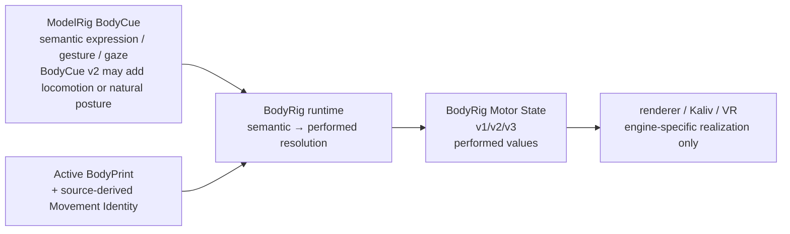

# BodyRig Motor State v1 + v2 + v3

ModelRig owns **what** the assistant means to express. BodyRig owns **how this body performs it**.

The boundary is deliberately two-stage and renderer-neutral:



A renderer must not need the original recovery model or source videos.

## Why a Motor State exists

If two cloned bodies receive the same ModelRig cue, they should not move identically.

A restrained BodyPrint may have low observed gesture amplitude and head motion. An expressive BodyPrint may have high values. `resolve_motor_state` combines the requested semantic intensity with those observed characteristics.

The renderer still owns engine-specific animation details such as Unity bone rotations or animation clips. BodyRig does **not** expose raw bone transforms as the ModelRig integration contract.

## Motor State v1

Motor State v1 is the compatibility contract. Its performed values are already personalized by BodyRig against the active BodyPrint.

Example:

```json
{
  "type": "bodyrig-motor-state",
  "version": 1,
  "body_id": "person-a",
  "utterance_id": "u-42",
  "motion": {
    "energy": 0.58,
    "head_motion": 0.73
  },
  "expression": {
    "emotion": "amused",
    "intensity": 0.6
  },
  "gesture": {
    "id": "small_shrug",
    "amplitude": 0.79
  },
  "gaze": {
    "target": "user",
    "strength": 0.77
  }
}
```

The exact numeric example is illustrative. Runtime values are deterministic from the current cue and active BodyPrint.

## Motor State v2

Motor State v2 preserves the performed state and adds an optional `embodiment` receipt containing only physical-style values that were actually present in the active BodyPrint.

```json
{
  "type": "bodyrig-motor-state",
  "version": 2,
  "body_id": "person-a",
  "utterance_id": "u-42",
  "motion": {
    "energy": 0.58,
    "head_motion": 0.73
  },
  "gesture": {
    "id": "small_shrug",
    "amplitude": 0.79
  },
  "gaze": {
    "target": "user",
    "strength": 0.77
  },
  "embodiment": {
    "source": "modelrig-bodyprint-v1",
    "observed": {
      "gesture_frequency": 0.57,
      "turn_speed": 0.42,
      "walk_cadence_spm": 112.0
    }
  }
}
```

The receipt is evidence, not a second personalization pass. A renderer must not multiply `embodiment.observed.gesture_amplitude`, `head_motion`, `gaze_strength`, `speech_motion`, posture descriptors, or other observations into the already-resolved performed values again. It must also not create a gesture, gait event, posture, expression, or semantic action solely because an observed BodyPrint field exists.

The reference Unity renderer accepts Motor State v1, v2 and v3. It validates v2/v3 embodiment evidence when present, but all animation is driven from already-performed fields. Raw `embodiment.observed` values are never consumed in the render loop.

## BodyCue v2 and Motor State v3

BodyCue v1 is frozen. BodyCue v2 adds explicit locomotion while preserving the existing semantic posture field.

Example locomotion cue:

```json
{
  "type": "modelrig-body-cue",
  "version": 2,
  "utterance_id": "u-walk",
  "locomotion": {
    "action": "walk",
    "effort": 0.5
  }
}
```

Supported locomotion actions are `walk`, `turn_left`, `turn_right`, and `stop`. Omitting `effort` means natural effort (`0.5`), not a generic gait.

Motor State v3 is the first performed contract allowed to contain locomotion. It resolves the explicit action through complete source-derived Movement Identity:

- `walk` uses the subject's observed cadence, relative stride length, stance width, vertical bounce, arm swing, and transition style;
- `turn_left` / `turn_right` use the requested direction plus the subject's observed turn-speed magnitude and transition style;
- `stop` carries the explicit stop semantic and the subject's observed transition style;
- effort may vary pace/amplitude within bounded limits around the observed identity; it never replaces the identity with generic defaults.

Example natural walk output:

```json
{
  "type": "bodyrig-motor-state",
  "version": 3,
  "body_id": "person-a",
  "utterance_id": "u-walk",
  "motion": {
    "energy": 0.72,
    "head_motion": 0.88
  },
  "locomotion": {
    "action": "walk",
    "effort": 0.5,
    "transition_intensity": 0.31,
    "cadence_spm": 116.0,
    "stride_length_to_height": 0.34,
    "stance_width_to_height": 0.13,
    "vertical_bounce_to_height": 0.024,
    "arm_swing_to_height": 0.19
  },
  "embodiment": {
    "source": "modelrig-bodyprint-v1",
    "observed": {
      "walk_cadence_spm": 116.0,
      "stride_length_to_height": 0.34
    }
  }
}
```

This is fail-closed. An explicit locomotion cue requires complete Movement Identity. Missing gait/posture/dynamics/idle evidence is an error; BodyRig does not substitute a generic walk. Explicit turns additionally require a positive, representable observed turn-speed.

A BodyCue v2 must never be requested through Motor State v1 or v2 because doing so would silently drop its v2 semantics. The runtime rejects that downgrade and requires Motor State v3.

Movement Identity observations alone still cannot produce a `locomotion` section. A BodyCue v1 routed through v3 remains non-locomoting unless an explicit v2 locomotion cue exists.

## Signed body-relative posture

Movement Identity keeps the original non-negative posture magnitudes for compatibility, but high-fidelity posture authority also requires signed, body-relative direction:

- `posture_torso_forward_lean_degrees`
- `posture_torso_right_lean_degrees`
- `posture_shoulder_roll_degrees`
- `posture_hip_roll_degrees`
- `posture_head_forward_offset_to_height`
- `posture_head_right_offset_to_height`

These values are derived from the recovered body's own lateral/forward basis rather than camera/world X/Z axes. A camera angle therefore does not become an invented left/right or forward/back posture semantic. Magnitude-only posture is insufficient for the high-fidelity Movement Identity gate because the renderer cannot honestly infer direction from an unsigned value.

BodyCue v2 can explicitly request the source-derived natural posture with the existing semantic field:

```json
{
  "type": "modelrig-body-cue",
  "version": 2,
  "utterance_id": "u-natural-posture",
  "posture": "natural"
}
```

Motor State v3 then emits a performed posture object. The explicit `source` marker distinguishes source authority from an ordinary legacy posture id:

```json
{
  "posture": {
    "id": "natural",
    "source": "modelrig-bodyprint-v1",
    "intensity": 1.0,
    "torso_forward_lean_degrees": 4.8,
    "torso_right_lean_degrees": -1.2,
    "shoulder_roll_degrees": -1.3,
    "hip_roll_degrees": -0.8,
    "head_forward_offset_to_height": 0.036,
    "head_right_offset_to_height": 0.019
  }
}
```

The values above are illustrative. BodyRig uses the active BodyPrint values. If `intensity` is omitted, source-derived natural posture uses full observed amplitude. An explicit lower intensity blends the performed signed values toward the neutral rig pose before they reach the renderer.

This remains fail-closed: `posture: "natural"` in BodyCue v2 requires complete source-derived Movement Identity, including all signed posture fields. BodyRig does not reconstruct missing signs from unsigned magnitudes.

The word `natural` itself is **not** an authority marker. BodyCue v1 is frozen and may already contain a generic posture id literally named `natural`. When that legacy cue is routed through Motor State v3, it remains the ordinary `{id, intensity}` posture shape. Only a Motor State v3 posture carrying `source: "modelrig-bodyprint-v1"` plus the complete signed field set is treated as source-derived natural posture.

### Reference renderer v3 realization

The reference Unity renderer consumes only performed Motor State v3 action objects. It never reads `embodiment.observed` in the animation loop.

`walk` is deliberately realized as an **in-place gait cycle**. Cadence controls cycle timing; stride and stance control leg motion; vertical bounce controls hips displacement relative to avatar height; and arm swing controls the upper arms unless an explicit gesture is simultaneously active. The renderer does not translate the avatar through world space because BodyCue v2 does not specify a destination, heading, or distance. Inventing those values would exceed the semantic contract.

`turn_left` and `turn_right` are different: direction is explicit in the cue, so the renderer may rotate the avatar using the already-performed turn rate. `stop` blends the gait pose back toward the bound neutral pose while preserving the avatar's world orientation.

Source-marked natural posture realizes the already-performed torso forward/right lean, shoulder/hip roll and head forward/right offset relative to the avatar's own orientation. The renderer does not recover direction from unsigned observations and does not read BodyPrint directly. Legacy generic posture ids, including an unmarked id named `natural`, retain their compatibility behavior and are not promoted to source authority.

The namespace-local Unity JSON guard validates required Motor State v3 locomotion and source-marked natural-posture field presence/types before `UnityEngine.JsonUtility` can turn missing or malformed numeric values into CLR zero.

## VoiceRig synchronization

VoiceRig timing is accepted only when `utterance_id` matches the active BodyCue. Motor State may then include:

- speech state;
- elapsed time;
- current viseme;
- amplitude resolved through the BodyPrint's speech-motion expressivity.

A stale VoiceRig event from a previous utterance is rejected rather than applied to the new body response.

## Body switches

Activating another `.mrbody` is a runtime session boundary. BodyRig clears:

- active utterance;
- current BodyCue;
- speech timing.

This prevents an animation or viseme from the previous body/profile leaking into the newly activated one.

## API

For the frozen BodyCue v1 path:

```text
POST /api/v1/runtime/cue
GET  /api/v1/runtime/motor-state
GET  /api/v2/runtime/motor-state
```

The v1 endpoint returns the unchanged v1 compatibility contract. The v2 endpoint returns Motor State v2 with observed embodiment evidence when the active BodyPrint contains supported observed values.

For BodyCue v2 locomotion and source-derived natural posture:

```text
POST /api/v2/runtime/cue
GET  /api/v3/runtime/motor-state
```

The v2 cue endpoint accepts BodyCue v2, including locomotion-only cues and `posture: "natural"`. The v3 motor endpoint resolves those semantics through the active source-derived Movement Identity. Once a BodyCue v2 is active, the older v1/v2 motor endpoints return conflict rather than silently discarding v2 semantics.

All motor endpoints fail closed when there is no active body/BodyPrint or no compatible active cue.

Machine-readable contracts:

- `contracts/body-cue-v1.schema.json`
- `contracts/body-cue-v2.schema.json`
- `contracts/bodyrig-motor-state-v1.schema.json`
- `contracts/bodyrig-motor-state-v2.schema.json`
- `contracts/bodyrig-motor-state-v3.schema.json`